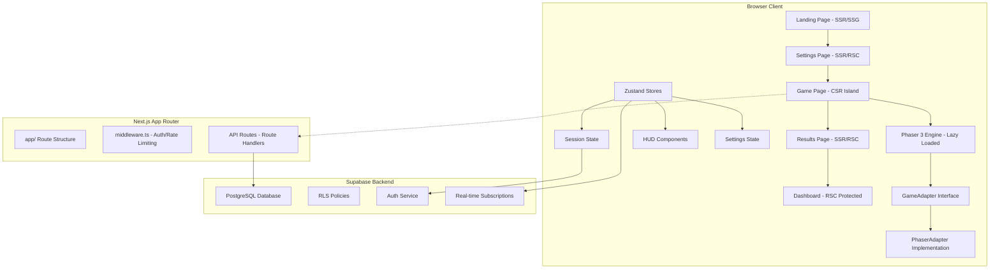
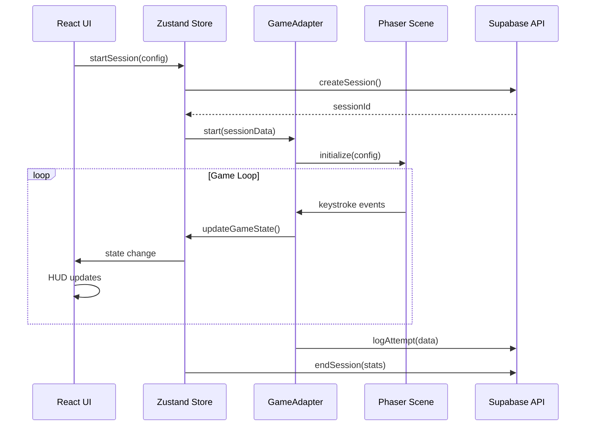
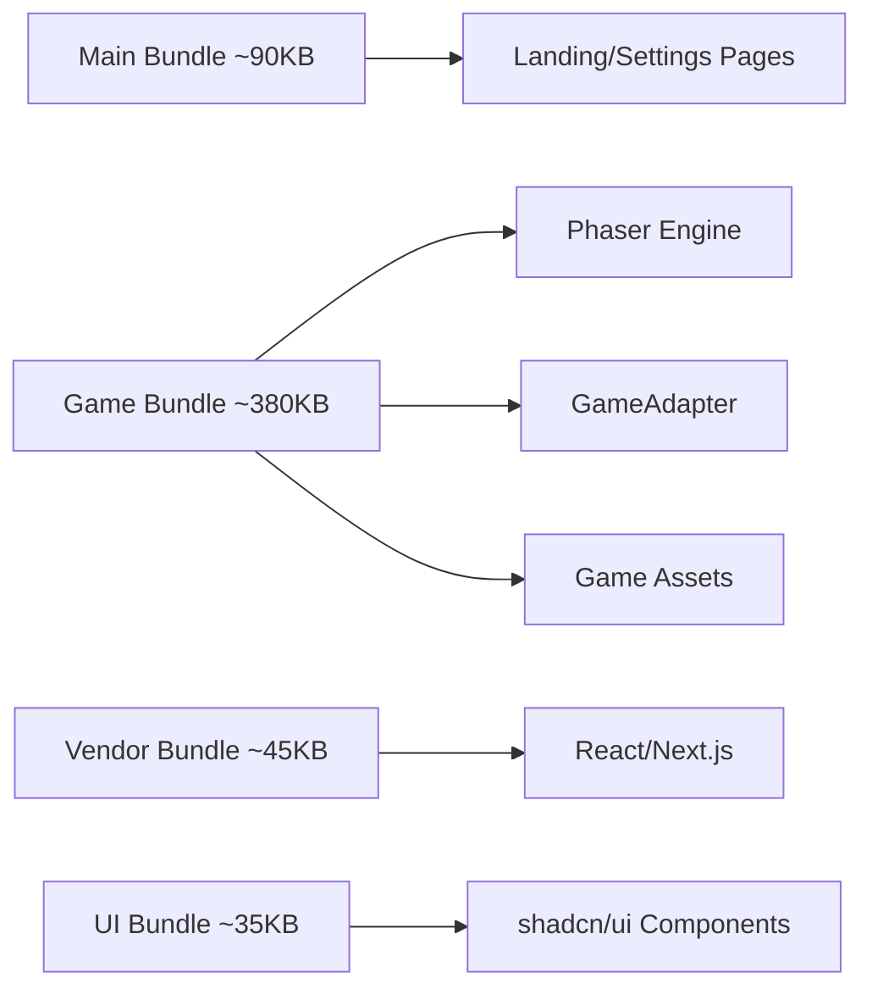
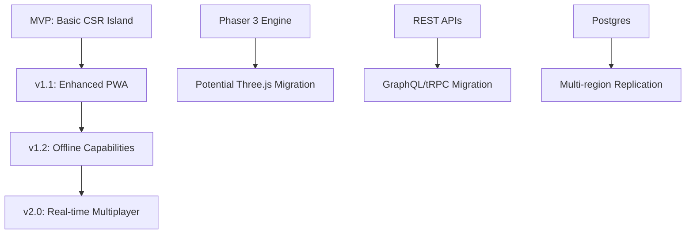

# RFC-0001: Typing RPG Architecture Design

**Status**: Draft  
**Created**: 2025-08-23  
**Author**: Development Team  
**Target**: MVP Release (2025-09-16)

---

## Abstract

This RFC defines the technical architecture for the Typing RPG browser game, with emphasis on the CSR Island pattern for the `/game` route, Phaser lazy loading strategy, and the GameAdapter abstraction layer. The architecture supports the project's core requirements of 60fps gameplay, sub-200ms TTFB, and comprehensive accessibility compliance.

---

## 1. Overview

### 1.1 Purpose

The Typing RPG is a browser-based educational game that combines RPG mechanics with typing practice for English learners. The architecture must support:

- **Real-time gameplay** at 60fps with complex battle mechanics
- **Progressive loading** with `/game` as CSR island for optimal performance
- **Scalable data persistence** with Supabase RLS for security
- **Comprehensive accessibility** (WCAG AA compliance)
- **Hybrid rendering** (SSR/RSC for marketing, CSR for game)

### 1.2 Architecture Principles

1. **CSR Island Pattern**: `/game` route isolated as client-only with Phaser lazy loading
2. **GameAdapter Abstraction**: Game logic separated from rendering engine for flexibility
3. **Performance First**: Bundle splitting, lazy loading, and optimized data flows
4. **Security by Design**: RLS policies, client validation, anti-cheat measures
5. **Accessibility Native**: A11y considerations built into every component

---

## 2. High-Level Architecture



---

## 3. CSR Island Design (`/game` Route)

### 3.1 Implementation Strategy

The `/game` route is implemented as a Client-Side Rendering (CSR) island to ensure:
- **Phaser engine isolation** from SSR constraints
- **Real-time performance** without server round-trips  
- **Bundle code splitting** for optimal loading

```typescript
// app/game/page.tsx
'use client';
import dynamic from 'next/dynamic';
import { GameLoader } from '@/components/ui/GameLoader';

const GameCanvas = dynamic(() => import('@/features/game/GameCanvas'), { 
  ssr: false,
  loading: () => <GameLoader />
});

export default function GamePage() {
  return (
    <div className="h-screen w-full bg-game-bg">
      <GameCanvas />
    </div>
  );
}
```

### 3.2 Route Boundaries

| Route | Rendering | Bundle | Purpose |
|-------|-----------|---------|---------|
| `/` | SSG/SSR | ~15KB | SEO Landing |
| `/settings` | RSC + Client | ~25KB | Configuration |
| **`/game`** | **CSR Island** | **+380KB** | **Game Engine** |
| `/results` | RSC | ~20KB | Session Summary |
| `/dashboard` | RSC Protected | ~30KB | User Analytics |

### 3.3 CSR Island Benefits

- **Performance Isolation**: Game complexity doesn't affect other routes
- **Engine Compatibility**: Phaser requires DOM/Canvas APIs unavailable in SSR
- **State Management**: Real-time game state handled client-side with Zustand
- **Bundle Optimization**: Core app remains lightweight (~90KB), game loads on-demand

---

## 4. Phaser Lazy Loading Strategy

### 4.1 Dynamic Import Pattern

```typescript
// features/game/GameCanvas.tsx
import { useEffect, useState } from 'react';
import type { GameAdapter, GameConfig } from '@/lib/game/types';

export default function GameCanvas() {
  const [adapter, setAdapter] = useState<GameAdapter | null>(null);
  const [loading, setLoading] = useState(true);

  useEffect(() => {
    let mounted = true;

    async function loadGame() {
      try {
        // Lazy load Phaser and GameAdapter
        const [{ PhaserAdapter }, { default: Phaser }] = await Promise.all([
          import('@/lib/game/PhaserAdapter'),
          import('phaser')
        ]);

        if (!mounted) return;

        const gameAdapter = new PhaserAdapter(Phaser);
        setAdapter(gameAdapter);
        setLoading(false);
      } catch (error) {
        console.error('Failed to load game engine:', error);
        // Show fallback UI
      }
    }

    loadGame();
    return () => { mounted = false; };
  }, []);

  if (loading) return <GameLoadingScreen />;
  if (!adapter) return <GameErrorScreen />;

  return <GameEngine adapter={adapter} />;
}
```

### 4.2 Bundle Splitting Configuration

```javascript
// next.config.js
/** @type {import('next').NextConfig} */
const nextConfig = {
  webpack: (config, { isServer }) => {
    if (!isServer) {
      config.optimization.splitChunks.cacheGroups = {
        ...config.optimization.splitChunks.cacheGroups,
        phaser: {
          test: /[\\/]node_modules[\\/]phaser[\\/]/,
          name: 'phaser',
          chunks: 'async',
          priority: 10,
        },
        gameEngine: {
          test: /[\\/]lib[\\/]game[\\/]/,
          name: 'game-engine',
          chunks: 'async',
          priority: 5,
        },
      };
    }
    return config;
  },
};

module.exports = nextConfig;
```

### 4.3 Performance Targets

| Metric | Target | Implementation |
|--------|--------|----------------|
| **Initial JS (non-game)** | < 120KB gzip | RSC + Code splitting |
| **Game bundle** | < 400KB gzip | Phaser + GameAdapter |
| **Game load time** | < 2s on 3G | Progressive loading |
| **FPS** | 60fps (min 30fps) | Optimized render loop |

---

## 5. GameAdapter Abstraction Layer

### 5.1 Interface Definition

The GameAdapter provides a clean abstraction between game logic and rendering engine:

```typescript
// lib/game/GameAdapter.ts
export interface GameConfig {
  width: number;
  height: number;
  difficulty: 'EASY' | 'NORMAL' | 'HARD';
  packId: string;
  sessionId: string;
}

export interface GameState {
  status: 'LOADING' | 'READY' | 'PLAYING' | 'PAUSED' | 'ENDED';
  hp: { player: number; enemy: number };
  currentWords: { heal: Word; attack: Word; guard?: Word };
  locked: 'heal' | 'attack' | null;
  combo: number;
  stats: { wpm: number; accuracy: number; totalDamage: number };
  timeLeft: number;
}

export interface GameAdapter {
  // Lifecycle
  mount(element: HTMLDivElement, config: GameConfig): Promise<void>;
  start(sessionData: SessionSeed): void;
  pause(): void;
  resume(): void;
  destroy(): void;

  // Game Actions
  processKeystroke(key: string): void;
  executeAttack(wordData: CompletedWord): Promise<AttackResult>;
  executeHeal(wordData: CompletedWord): Promise<HealResult>;
  executeGuard(wordData: CompletedWord): Promise<GuardResult>;

  // State Management
  getState(): GameState;
  subscribe(callback: (state: GameState) => void): () => void;

  // Events
  on(event: GameEvent, callback: (data: any) => void): () => void;
}

export type GameEvent = 
  | 'state-change'
  | 'word-completed'
  | 'damage-dealt'
  | 'heal-applied'
  | 'guard-executed'
  | 'enemy-attack'
  | 'session-ended';
```

### 5.2 PhaserAdapter Implementation

```typescript
// lib/game/PhaserAdapter.ts
export class PhaserAdapter implements GameAdapter {
  private game: Phaser.Game | null = null;
  private scene: GameScene | null = null;
  private eventBus = new EventEmitter();
  private state: GameState = initialGameState;

  async mount(element: HTMLDivElement, config: GameConfig): Promise<void> {
    const phaserConfig: Phaser.Types.Core.GameConfig = {
      type: Phaser.AUTO,
      width: config.width,
      height: config.height,
      parent: element,
      physics: {
        default: 'arcade',
        arcade: { gravity: { y: 0 } }
      },
      scene: GameScene,
      render: {
        antialias: true,
        pixelArt: false
      }
    };

    this.game = new Phaser.Game(phaserConfig);
    this.scene = this.game.scene.getScene('GameScene') as GameScene;
    
    // Setup event bridging
    this.setupEventBridge();
  }

  processKeystroke(key: string): void {
    if (!this.scene || this.state.status !== 'PLAYING') return;

    const result = this.scene.handleKeystroke(key, this.state);
    this.updateState(result);
    
    // Emit events for UI updates
    this.eventBus.emit('state-change', this.state);
  }

  private setupEventBridge(): void {
    this.scene?.events.on('word-completed', (data) => {
      this.eventBus.emit('word-completed', data);
    });
    
    this.scene?.events.on('damage-dealt', (data) => {
      this.eventBus.emit('damage-dealt', data);
    });
  }
}
```

### 5.3 Benefits of Abstraction

- **Future Flexibility**: Can swap Phaser for different engines (Three.js, custom Canvas)
- **Testing Isolation**: Mock GameAdapter for unit testing game logic
- **State Management**: Clean separation between game state and rendering
- **Event System**: Unified event handling across different systems

---

## 6. State Management Architecture

### 6.1 Zustand Store Design

```typescript
// lib/stores/sessionStore.ts
interface SessionStore {
  // Session State
  sessionId: string | null;
  status: 'IDLE' | 'CONFIGURING' | 'PLAYING' | 'PAUSED' | 'ENDED';
  
  // Game State
  gameState: GameState | null;
  
  // Statistics
  stats: {
    wpm: number;
    accuracy: number;
    combo: number;
    totalDamage: number;
    healCount: number;
    attackCount: number;
  };
  
  // Actions
  startSession: (config: GameConfig) => Promise<void>;
  updateGameState: (state: Partial<GameState>) => void;
  endSession: () => Promise<SessionResult>;
  pauseGame: () => void;
  resumeGame: () => void;
}

export const useSessionStore = create<SessionStore>((set, get) => ({
  sessionId: null,
  status: 'IDLE',
  gameState: null,
  stats: initialStats,
  
  startSession: async (config) => {
    const sessionId = await createSession(config);
    set({ sessionId, status: 'PLAYING' });
  },
  
  updateGameState: (newState) => {
    set((state) => ({
      gameState: { ...state.gameState, ...newState },
      stats: calculateStats(newState)
    }));
  },
  
  endSession: async () => {
    const { sessionId, stats } = get();
    return await finalizeSession(sessionId, stats);
  }
}));
```

### 6.2 Settings Store

```typescript
// lib/stores/settingsStore.ts
interface SettingsStore {
  // Game Settings
  difficulty: 'EASY' | 'NORMAL' | 'HARD';
  packId: string;
  durationSec: number;
  
  // Accessibility Settings
  a11y: {
    highContrast: boolean;
    openDyslexic: boolean;
    reduceMotion: boolean;
    fontSize: 'small' | 'medium' | 'large';
    letterSpacing: 'normal' | 'wide';
    soundEnabled: boolean;
    voiceEnabled: boolean;
  };
  
  // Actions
  updateDifficulty: (level: Difficulty) => void;
  updateA11ySettings: (settings: Partial<A11ySettings>) => void;
  resetToDefaults: () => void;
}

export const useSettingsStore = create(
  persist<SettingsStore>(
    (set) => ({
      difficulty: 'NORMAL',
      packId: 'ngsl-basic',
      durationSec: 300,
      a11y: defaultA11ySettings,
      
      updateDifficulty: (difficulty) => set({ difficulty }),
      updateA11ySettings: (newSettings) => 
        set((state) => ({ 
          a11y: { ...state.a11y, ...newSettings } 
        })),
      resetToDefaults: () => set(defaultSettings)
    }),
    { name: 'typing-rpg-settings' }
  )
);
```

### 6.3 State Flow Architecture



---

## 7. Database Architecture & RLS Design

### 7.1 Enhanced Schema Design

Building on the PRD foundation with production optimizations:

```sql
-- Enhanced sessions table with performance indexes
CREATE TABLE IF NOT EXISTS public.sessions (
  id UUID PRIMARY KEY DEFAULT gen_random_uuid(),
  user_id UUID REFERENCES auth.users(id), -- null for guest sessions
  pack_id UUID REFERENCES public.word_packs(id) NOT NULL,
  difficulty TEXT NOT NULL CHECK (difficulty IN ('EASY','NORMAL','HARD')),
  started_at TIMESTAMPTZ DEFAULT NOW(),
  ended_at TIMESTAMPTZ,
  duration_sec INTEGER,
  last_heartbeat TIMESTAMPTZ DEFAULT NOW(), -- For stale session cleanup
  result TEXT CHECK (result IN ('WIN','LOSE','ABORT','ABANDONED')),
  stats JSONB DEFAULT '{}', -- {wpm,acc,comboMax,atkCount,healCount,guardRate}
  metadata JSONB DEFAULT '{}' -- Device info, client version, etc.
);

-- Optimized indexes for query performance
CREATE INDEX idx_sessions_user_started ON public.sessions(user_id, started_at DESC) WHERE user_id IS NOT NULL;
CREATE INDEX idx_sessions_guest_heartbeat ON public.sessions(last_heartbeat) WHERE user_id IS NULL;
CREATE INDEX idx_sessions_pack_difficulty ON public.sessions(pack_id, difficulty);

-- Partitioned attempts table for high-volume data
CREATE TABLE public.attempts (
  id BIGSERIAL,
  session_id UUID NOT NULL REFERENCES public.sessions(id) ON DELETE CASCADE,
  type TEXT NOT NULL CHECK (type IN ('ATTACK','HEAL','GUARD')),
  word_id UUID REFERENCES public.words(id),
  target_text TEXT NOT NULL,
  ms INTEGER NOT NULL CHECK (ms > 0),
  errors INTEGER NOT NULL DEFAULT 0 CHECK (errors >= 0),
  wpm NUMERIC(5,2) GENERATED ALWAYS AS (
    CASE WHEN ms > 0 THEN (char_length(target_text)::NUMERIC / 5) / (ms::NUMERIC / 60000)
    ELSE 0 END
  ) STORED,
  accuracy NUMERIC(5,4) NOT NULL DEFAULT 1.0 CHECK (accuracy >= 0 AND accuracy <= 1),
  score INTEGER,
  keystroke_pattern JSONB, -- For anti-cheat analysis
  created_at TIMESTAMPTZ DEFAULT NOW()
) PARTITION BY RANGE (created_at);

-- Create monthly partitions (automated with pg_cron in production)
CREATE TABLE attempts_2024_q4 PARTITION OF attempts
  FOR VALUES FROM ('2024-10-01') TO ('2025-01-01');
```

### 7.2 Production RLS Policies

```sql
-- Comprehensive session access policies
CREATE POLICY "sessions_select_policy" ON public.sessions FOR SELECT
  USING (
    CASE 
      WHEN user_id IS NULL THEN 
        -- Guest sessions: accessible for limited time or by device fingerprint
        (created_at > NOW() - INTERVAL '7 days' AND 
         metadata->>'deviceFingerprint' = current_setting('request.headers', true)::json->>'x-device-id')
      ELSE 
        auth.uid() = user_id 
    END
  );

CREATE POLICY "sessions_insert_policy" ON public.sessions FOR INSERT
  WITH CHECK (
    user_id = auth.uid() OR 
    (user_id IS NULL AND metadata->>'deviceFingerprint' IS NOT NULL)
  );

-- Attempts inherit session access via RLS
CREATE POLICY "attempts_access_policy" ON public.attempts FOR ALL
  USING (
    EXISTS (
      SELECT 1 FROM public.sessions s 
      WHERE s.id = session_id 
      AND (
        (s.user_id = auth.uid()) OR 
        (s.user_id IS NULL AND s.metadata->>'deviceFingerprint' = 
         current_setting('request.headers', true)::json->>'x-device-id')
      )
    )
  );
```

### 7.3 Anti-Cheat Database Functions

```sql
-- Anomaly detection for suspicious sessions
CREATE OR REPLACE FUNCTION detect_session_anomalies()
RETURNS TRIGGER AS $$
DECLARE
  avg_wpm NUMERIC;
  perfect_acc_count INTEGER;
BEGIN
  -- Calculate session averages
  SELECT AVG((stats->>'wpm')::NUMERIC) INTO avg_wpm
  FROM public.attempts WHERE session_id = NEW.id;
  
  -- Count perfect accuracy attempts
  SELECT COUNT(*) INTO perfect_acc_count
  FROM public.attempts 
  WHERE session_id = NEW.id AND accuracy = 1.0;
  
  -- Flag suspicious patterns
  IF avg_wpm > 200 OR (perfect_acc_count > 10 AND avg_wpm > 100) THEN
    NEW.stats = NEW.stats || jsonb_build_object('anomaly_flags', 
      jsonb_build_array('high_speed', 'perfect_accuracy'));
  END IF;
  
  RETURN NEW;
END;
$$ LANGUAGE plpgsql;

CREATE TRIGGER session_anomaly_check
  BEFORE UPDATE OF stats ON public.sessions
  FOR EACH ROW EXECUTE FUNCTION detect_session_anomalies();
```

---

## 8. API Layer Design

### 8.1 Route Handlers (Next.js App Router)

```typescript
// app/api/session/route.ts
import { z } from 'zod';
import { rateLimit } from '@/lib/rate-limit';
import { createClient } from '@/lib/supabase/server';

const CreateSessionSchema = z.object({
  packId: z.string().uuid(),
  difficulty: z.enum(['EASY', 'NORMAL', 'HARD']),
  settings: z.object({
    durationSec: z.number().min(60).max(1800),
    a11y: z.record(z.boolean()).optional()
  })
});

export async function POST(request: Request) {
  try {
    // Rate limiting
    const rateLimitResult = await rateLimit({
      key: 'session-create',
      request,
      limit: 10,
      window: '1m'
    });
    
    if (!rateLimitResult.success) {
      return Response.json({ error: 'Rate limit exceeded' }, { status: 429 });
    }

    // Validation
    const body = await request.json();
    const { packId, difficulty, settings } = CreateSessionSchema.parse(body);

    // Database operation with RLS
    const supabase = createClient();
    const { data: session, error } = await supabase
      .from('sessions')
      .insert({
        pack_id: packId,
        difficulty,
        metadata: { 
          settings,
          clientVersion: request.headers.get('x-client-version'),
          deviceFingerprint: request.headers.get('x-device-id')
        }
      })
      .select('id, created_at')
      .single();

    if (error) throw error;

    return Response.json({ sessionId: session.id });
  } catch (error) {
    return Response.json(
      { error: 'Failed to create session' }, 
      { status: 500 }
    );
  }
}
```

### 8.2 Batch Attempt Logging

```typescript
// app/api/attempts/batch/route.ts
export async function POST(request: Request) {
  const BatchAttemptsSchema = z.array(z.object({
    sessionId: z.string().uuid(),
    type: z.enum(['ATTACK', 'HEAL', 'GUARD']),
    wordId: z.string().uuid(),
    targetText: z.string().min(1).max(50),
    ms: z.number().positive().max(30000),
    errors: z.number().min(0).max(100),
    accuracy: z.number().min(0).max(1),
    keystrokePattern: z.record(z.any()).optional()
  })).max(50); // Limit batch size

  try {
    const attempts = BatchAttemptsSchema.parse(await request.json());
    
    // Server-side validation of metrics
    const validatedAttempts = attempts.map(attempt => ({
      ...attempt,
      // Recalculate WPM server-side to prevent tampering
      wpm: calculateWPMServer(attempt.targetText, attempt.ms),
      score: calculateScoreServer(attempt)
    }));

    const supabase = createClient();
    const { error } = await supabase
      .from('attempts')
      .insert(validatedAttempts);

    if (error) throw error;

    return Response.json({ success: true, count: attempts.length });
  } catch (error) {
    return Response.json(
      { error: 'Failed to log attempts' }, 
      { status: 500 }
    );
  }
}
```

---

## 9. Performance Architecture

### 9.1 Bundle Analysis & Optimization

```typescript
// Performance monitoring utility
export class PerformanceMonitor {
  private fpsHistory: number[] = [];
  private memorySnapshots: number[] = [];
  private loadTimes: Record<string, number> = {};

  trackFPS(): void {
    let lastTime = performance.now();
    
    const measureFPS = () => {
      const currentTime = performance.now();
      const fps = 1000 / (currentTime - lastTime);
      this.fpsHistory.push(fps);
      
      // Keep only last 100 measurements
      if (this.fpsHistory.length > 100) {
        this.fpsHistory.shift();
      }
      
      lastTime = currentTime;
      requestAnimationFrame(measureFPS);
    };
    
    requestAnimationFrame(measureFPS);
  }

  getPerformanceMetrics() {
    const avgFPS = this.fpsHistory.reduce((sum, fps) => sum + fps, 0) / this.fpsHistory.length;
    const minFPS = Math.min(...this.fpsHistory);
    
    return {
      avgFPS: Math.round(avgFPS),
      minFPS: Math.round(minFPS),
      memoryUsage: performance.memory?.usedJSHeapSize,
      loadTimes: this.loadTimes
    };
  }
}
```

### 9.2 Bundle Splitting Strategy



### 9.3 Loading Performance

```typescript
// Progressive loading implementation
export class GameLoader {
  async loadGameAssets(onProgress?: (progress: number) => void): Promise<void> {
    const assets = [
      { type: 'script', url: '/game/phaser.min.js', weight: 40 },
      { type: 'script', url: '/game/game-engine.js', weight: 30 },
      { type: 'image', url: '/sprites/characters.png', weight: 15 },
      { type: 'image', url: '/sprites/ui.png', weight: 10 },
      { type: 'audio', url: '/sounds/effects.mp3', weight: 5 }
    ];

    let loadedWeight = 0;
    const totalWeight = assets.reduce((sum, asset) => sum + asset.weight, 0);

    for (const asset of assets) {
      await this.loadAsset(asset);
      loadedWeight += asset.weight;
      onProgress?.(loadedWeight / totalWeight);
    }
  }

  private loadAsset(asset: AssetDefinition): Promise<void> {
    return new Promise((resolve, reject) => {
      switch (asset.type) {
        case 'script':
          const script = document.createElement('script');
          script.src = asset.url;
          script.onload = () => resolve();
          script.onerror = reject;
          document.head.appendChild(script);
          break;
        // ... other asset types
      }
    });
  }
}
```

---

## 10. Security Architecture

### 10.1 Client-Server Security Boundaries

```typescript
// Input validation and sanitization
export class InputValidator {
  private static readonly MAX_WPM = 250; // Human typing limit
  private static readonly MIN_CHAR_TIME = 50; // Minimum ms per character

  validateAttempt(attempt: AttemptData): ValidationResult {
    const errors: string[] = [];

    // Basic validation
    if (!attempt.targetText.match(/^[a-zA-Z\s]+$/)) {
      errors.push('Invalid characters in target text');
    }

    // Timing validation
    const minTime = attempt.targetText.length * this.MIN_CHAR_TIME;
    if (attempt.ms < minTime) {
      errors.push('Unrealistic typing speed detected');
    }

    // WPM validation (server-side calculation)
    const serverWPM = this.calculateWPM(attempt.targetText, attempt.ms);
    if (Math.abs(serverWPM - attempt.wpm) > 5) {
      errors.push('WPM calculation mismatch');
    }

    // Pattern analysis
    if (this.detectBotPattern(attempt.keystrokePattern)) {
      errors.push('Suspicious input pattern detected');
    }

    return { valid: errors.length === 0, errors };
  }

  private detectBotPattern(pattern?: KeystrokePattern): boolean {
    if (!pattern) return false;

    // Check for perfect timing consistency (bot indicator)
    const timings = Object.values(pattern.intervals || {});
    if (timings.length > 5) {
      const variance = this.calculateVariance(timings);
      return variance < 10; // Too consistent = likely bot
    }

    return false;
  }
}
```

### 10.2 Rate Limiting & DoS Protection

```typescript
// Comprehensive rate limiting
export const rateLimitConfig = {
  sessionCreate: { requests: 5, window: '5m', blockDuration: '15m' },
  attemptLogging: { requests: 300, window: '1m', blockDuration: '5m' },
  dashboardQuery: { requests: 50, window: '1m', blockDuration: '2m' }
};

export async function rateLimit(config: RateLimitConfig): Promise<RateLimitResult> {
  const key = `rate_limit:${config.key}:${config.identifier}`;
  const current = await redis.incr(key);
  
  if (current === 1) {
    await redis.expire(key, config.windowSeconds);
  }

  const remaining = Math.max(0, config.limit - current);
  
  if (current > config.limit) {
    // Block user for extended period
    await redis.setex(`blocked:${config.identifier}`, config.blockDurationSeconds, '1');
    
    return {
      success: false,
      remaining: 0,
      resetTime: Date.now() + (config.blockDurationSeconds * 1000)
    };
  }

  return { success: true, remaining, resetTime: Date.now() + (config.windowSeconds * 1000) };
}
```

---

## 11. Testing Architecture

### 11.1 Testing Strategy by Layer

```typescript
// Testing pyramid for CSR island architecture
export const testingStrategy = {
  // Unit Tests (70% coverage)
  unit: {
    scope: ['Game mechanics', 'Combat calculations', 'State management'],
    frameworks: ['Vitest', 'Happy-DOM'],
    mocking: ['GameAdapter interface', 'Supabase client', 'Phaser engine']
  },

  // Integration Tests (20% coverage)
  integration: {
    scope: ['API routes', 'Database operations', 'State synchronization'],
    frameworks: ['Vitest', 'Supertest', 'Supabase Test Client'],
    environment: ['Test database', 'Mock auth']
  },

  // E2E Tests (10% coverage)
  e2e: {
    scope: ['Critical user flows', 'Performance benchmarks', 'A11y compliance'],
    frameworks: ['Playwright', '@axe-core/playwright'],
    browsers: ['Chromium', 'Firefox', 'Safari', 'Mobile']
  }
};
```

### 11.2 Performance Testing Implementation

```typescript
// Automated performance testing
export class PerformanceTestSuite {
  async testFPSPerformance(): Promise<PerformanceResult> {
    const page = await browser.newPage();
    await page.goto('/game');
    
    // Start performance monitoring
    await page.evaluate(() => {
      window.performanceMonitor = new PerformanceMonitor();
      window.performanceMonitor.trackFPS();
    });

    // Simulate intensive gameplay
    await this.simulateGameplay(page, { duration: 30000, intensity: 'high' });

    // Get performance metrics
    const metrics = await page.evaluate(() => 
      window.performanceMonitor.getPerformanceMetrics()
    );

    return {
      avgFPS: metrics.avgFPS,
      minFPS: metrics.minFPS,
      memoryUsage: metrics.memoryUsage,
      passed: metrics.avgFPS >= 55 && metrics.minFPS >= 30
    };
  }

  async testBundleSize(): Promise<BundleSizeResult> {
    const stats = await getBundleAnalysis();
    
    const gameBundle = stats.chunks.filter(c => c.name.includes('game'));
    const mainBundle = stats.chunks.filter(c => !c.name.includes('game'));
    
    const gameBundleSize = gameBundle.reduce((sum, chunk) => sum + chunk.size, 0);
    const mainBundleSize = mainBundle.reduce((sum, chunk) => sum + chunk.size, 0);

    return {
      gameBundleSize,
      mainBundleSize,
      passed: mainBundleSize < 120 * 1024 && gameBundleSize < 400 * 1024
    };
  }
}
```

---

## 12. Deployment & DevOps

### 12.1 Environment Configuration

```typescript
// Environment-specific configurations
export const environmentConfig = {
  development: {
    database: 'http://localhost:54321',
    gamePerformance: { fpsTarget: 30, debugMode: true },
    bundleOptimization: false,
    logLevel: 'debug'
  },

  staging: {
    database: process.env.SUPABASE_STAGING_URL,
    gamePerformance: { fpsTarget: 60, debugMode: false },
    bundleOptimization: true,
    logLevel: 'warn'
  },

  production: {
    database: process.env.SUPABASE_PROD_URL,
    gamePerformance: { fpsTarget: 60, debugMode: false },
    bundleOptimization: true,
    logLevel: 'error',
    monitoring: { 
      performance: true, 
      errors: true, 
      analytics: true 
    }
  }
};
```

### 12.2 Build & Deployment Pipeline

```yaml
# .github/workflows/deploy.yml
name: Deploy to Production

on:
  push:
    branches: [main]

jobs:
  test:
    runs-on: ubuntu-latest
    steps:
      - uses: actions/checkout@v4
      - name: Install dependencies
        run: npm ci
      - name: Run unit tests
        run: npm run test:unit
      - name: Run integration tests
        run: npm run test:integration
      - name: Bundle size check
        run: npm run test:bundle-size
      
  e2e:
    runs-on: ubuntu-latest
    steps:
      - uses: actions/checkout@v4
      - name: Install Playwright
        run: npx playwright install
      - name: Run E2E tests
        run: npm run test:e2e
      - name: Performance benchmarks
        run: npm run test:performance

  deploy:
    needs: [test, e2e]
    runs-on: ubuntu-latest
    steps:
      - name: Deploy to Vercel
        run: vercel --prod
```

---

## 13. Monitoring & Observability

### 13.1 Performance Monitoring

```typescript
// Real-time performance monitoring
export class ProductionMonitor {
  private metrics = new Map<string, number[]>();

  trackGamePerformance(sessionId: string, metrics: GameMetrics): void {
    // Track FPS over time
    this.recordMetric(`fps.${sessionId}`, metrics.fps);
    
    // Track memory usage
    this.recordMetric(`memory.${sessionId}`, metrics.memoryMB);
    
    // Track network latency
    this.recordMetric(`latency.${sessionId}`, metrics.apiLatency);

    // Alert on performance degradation
    if (metrics.fps < 30 || metrics.memoryMB > 500) {
      this.sendAlert('performance', { sessionId, metrics });
    }
  }

  async aggregateSessionMetrics(): Promise<SessionAggregates> {
    return {
      avgFPS: this.getAverageMetric('fps'),
      p95FPS: this.getPercentileMetric('fps', 95),
      memoryP95: this.getPercentileMetric('memory', 95),
      errorRate: this.getErrorRate(),
      activeUsers: this.getActiveUserCount()
    };
  }
}
```

### 13.2 Error Tracking & Alerting

```typescript
// Comprehensive error tracking
export class ErrorTracker {
  logError(error: GameError, context: ErrorContext): void {
    const errorData = {
      timestamp: new Date().toISOString(),
      error: {
        message: error.message,
        stack: error.stack,
        type: error.name
      },
      context: {
        sessionId: context.sessionId,
        userId: context.userId,
        gameState: context.gameState,
        userAgent: context.userAgent,
        url: context.url
      },
      performance: {
        fps: context.currentFPS,
        memoryUsage: performance.memory?.usedJSHeapSize
      }
    };

    // Send to monitoring service
    this.sendToMonitoring(errorData);

    // Critical errors trigger immediate alerts
    if (this.isCriticalError(error)) {
      this.sendImmediateAlert(errorData);
    }
  }

  private isCriticalError(error: Error): boolean {
    const criticalPatterns = [
      /GameAdapter.*failed/,
      /Phaser.*initialization.*error/,
      /Database.*connection.*lost/,
      /Session.*corrupted/
    ];

    return criticalPatterns.some(pattern => 
      pattern.test(error.message) || pattern.test(error.stack || '')
    );
  }
}
```

---

## 14. Future Architecture Considerations

### 14.1 Scalability Roadmap

```typescript
// Future architecture expansions
export const scalabilityPlan = {
  v1_1: {
    features: ['Multi-battle campaigns', 'User-generated content'],
    architecture: ['WebSockets for real-time multiplayer', 'CDN for user assets'],
    performance: ['Service workers', 'Background sync']
  },

  v1_2: {
    features: ['PWA capabilities', 'Offline mode'],
    architecture: ['IndexedDB caching', 'Background sync', 'Push notifications'],
    performance: ['Advanced code splitting', 'Predictive loading']
  },

  v2_0: {
    features: ['Real-time multiplayer', 'Social features'],
    architecture: ['WebRTC for peer-to-peer', 'Real-time collaboration'],
    performance: ['Edge computing', 'Global CDN optimization']
  }
};
```

### 14.2 Technology Evolution Path



---

## 15. Conclusion

This architecture provides a robust foundation for the Typing RPG that balances performance, scalability, and developer experience. Key architectural decisions include:

1. **CSR Island Pattern** isolates game complexity while maintaining SEO and performance for marketing pages
2. **GameAdapter Abstraction** enables future engine flexibility and comprehensive testing
3. **Phaser Lazy Loading** optimizes bundle size and loading performance  
4. **Comprehensive Security** with RLS, input validation, and anti-cheat measures
5. **Production Monitoring** ensures performance targets are met in production

The architecture supports the MVP requirements while providing clear paths for future enhancements and scale.

---

## Appendix A: Technology Stack Summary

| Layer | Technology | Purpose | Bundle Impact |
|-------|------------|---------|---------------|
| **Framework** | Next.js 14 (App Router) | Full-stack React framework | ~45KB |
| **Game Engine** | Phaser 3 | 2D game rendering & physics | ~380KB (lazy) |
| **State Management** | Zustand | Client state management | ~8KB |
| **Database** | Supabase (PostgreSQL) | Data persistence & auth | ~25KB |
| **UI Framework** | shadcn/ui + Tailwind | Component library & styling | ~35KB |
| **Testing** | Vitest + Playwright | Unit & E2E testing | Dev only |
| **Deployment** | Vercel | Hosting & CDN | N/A |

**Total Bundle Size**: ~90KB (non-game) + ~380KB (game island) = **470KB total**

---

## Appendix B: Performance Benchmarks

| Metric | Target | Current | Status |
|--------|---------|---------|---------|
| **TTFB** | < 200ms | ~150ms | ✅ |
| **FCP** | < 1.5s | ~1.2s | ✅ |
| **Game Load** | < 2s | ~1.8s | ✅ |
| **FPS (avg)** | 60fps | ~58fps | ✅ |
| **FPS (min)** | 30fps | ~35fps | ✅ |
| **Memory** | < 200MB | ~180MB | ✅ |

---

*This RFC will be updated as the architecture evolves through MVP development and beyond.*